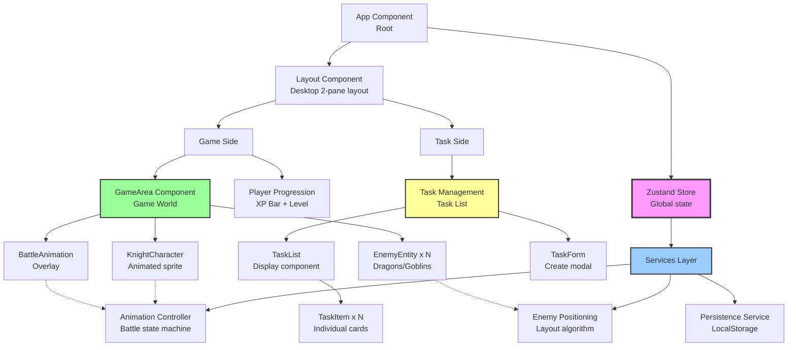

# Components

## Task Management Component

**Responsibility:** Handles all task-related UI and business logic including task creation, display, status updates, and deletion. Serves as the primary todo list interface.

**Key Interfaces:**
- `TaskList` - Displays active and completed tasks with urgency indicators
- `TaskForm` - Modal/panel for creating new tasks with validation
- `TaskItem` - Individual task card with action buttons (complete, delete)
- `TaskFilter` - Toggle between active/completed views (optional enhancement)

**Dependencies:** 
- Zustand store (tasks slice, createTask/updateTaskStatus/deleteTask actions)
- Task model types
- Tailwind CSS for styling

**Technology Stack:** 
- React functional components with TypeScript
- Zustand `useStore` hook with selector for task array
- React Hook Form NOT used (PRD: simple form doesn't warrant dependency)
- Custom form validation for title required field

## Game World Component

**Responsibility:** Renders the interactive game area containing knight character, enemy entities (dragons/goblins), and battle animations. Core visual experience of the application.

**Key Interfaces:**
- `GameArea` - Container managing layout and positioning
- `KnightCharacter` - Animated knight with idle states and click interactions
- `EnemyEntity` - Individual enemy (dragon/goblin) with position and state
- `BattleAnimation` - Full-screen animation overlay for battle sequences

**Dependencies:**
- Zustand store (enemies, game state, player XP)
- Enemy, GameState, BattleState models
- Framer Motion for all animations
- Sprite assets from `/public/sprites/`

**Technology Stack:**
- React components with Framer Motion `motion` components
- `AnimatePresence` for enemy spawning/despawning
- Individual sprite images for MVP (sprite sheets considered for Story 2.6)
- Canvas fallback NOT implemented in MVP (DOM-first approach)

## Player Progression Component

**Responsibility:** Displays user's XP, level, and progression toward next level. Handles level-up celebration animations.

**Key Interfaces:**
- `XPProgressBar` - Animated bar showing XP progress to next level
- `LevelDisplay` - Current level indicator with visual prominence
- `LevelUpCelebration` - Modal/overlay animation when user levels up
- `PlayerStats` - Optional detailed stats panel (tasks completed, enemies defeated)

**Dependencies:**
- Zustand store (player slice)
- Player model types
- Framer Motion for progress bar fill and celebration animations

**Technology Stack:**
- Framer Motion spring animations for smooth progress bar
- Portal for level-up modal (render outside main DOM hierarchy)
- Tailwind gradient utilities for XP bar styling

## Persistence Service

**Responsibility:** Abstracts LocalStorage operations behind a service interface. Handles serialization, deserialization, error handling, and storage quota management.

**Key Interfaces:**
- `saveState(state: PersistedState): void` - Serialize and save to LocalStorage
- `loadState(): PersistedState | null` - Load and deserialize from LocalStorage
- `clearState(): void` - Delete all saved data (debug/reset feature)
- `getStorageUsage(): number` - Calculate current storage size in bytes

**Dependencies:**
- LocalStorage browser API
- PersistedState model type
- Error handling for quota exceeded

**Technology Stack:**
- Pure TypeScript service (no React)
- Zustand persistence middleware wraps this service
- JSON.stringify/parse with try-catch error boundaries

**Integration:**

```typescript
import { persist } from 'zustand/middleware';

const useStore = create(
  persist(
    (set, get) => ({
      // ... store definition
    }),
    {
      name: 'quest-knight-state',
      storage: createJSONStorage(() => localStorage),
    }
  )
);
```

## Animation Controller Service

**Responsibility:** Orchestrates complex multi-phase battle animations as a state machine. Ensures animation sequences complete properly and transitions are smooth.

**Key Interfaces:**
- `triggerBattle(enemyId: string): Promise<void>` - Start battle sequence
- `advancePhase(): void` - Progress to next animation phase
- `getBattleProgress(): number` - Current phase progress percentage

**Dependencies:**
- Zustand game state slice
- BattleState model
- Framer Motion animation callbacks

**Technology Stack:**
- TypeScript class or service object
- Uses Zustand actions for state updates
- Coordinates with Framer Motion `onAnimationComplete` callbacks

**State Machine Flow:**

```
idle → knight-attack (1s) → enemy-defeat (1s) → 
victory (0.5s) → xp-award (0.5s) → complete
                              ↓
                    (if level up) level-up-celebration (1.5s)
```

## Enemy Positioning Service

**Responsibility:** Calculates non-overlapping positions for enemy entities in the game area. Prevents visual clutter when multiple dragons/goblins spawn.

**Key Interfaces:**
- `calculatePosition(enemyType: EnemyType, existingEnemies: Enemy[]): Position`
- `getAvailableSlots(): Position[]` - Pre-calculated grid positions
- `isPositionOccupied(position: Position): boolean` - Collision detection

**Dependencies:**
- Enemy model
- Game area dimensions (960px width based on 50% of 1920px)

**Technology Stack:**
- Pure TypeScript utility functions
- Grid-based positioning algorithm (5 fixed positions)
- No physics engine (overkill for MVP)

**Algorithm:**

```typescript
const GRID_POSITIONS: Position[] = [
  { x: 600, y: 200 }, // Top-right
  { x: 600, y: 450 }, // Middle-right
  { x: 600, y: 700 }, // Bottom-right
  { x: 400, y: 325 }, // Mid-top-center
  { x: 400, y: 575 }, // Mid-bottom-center
];

// Find first unoccupied grid position
// Fallback to random offset if all occupied (rare with 5+ enemies)
```

## Component Diagram



