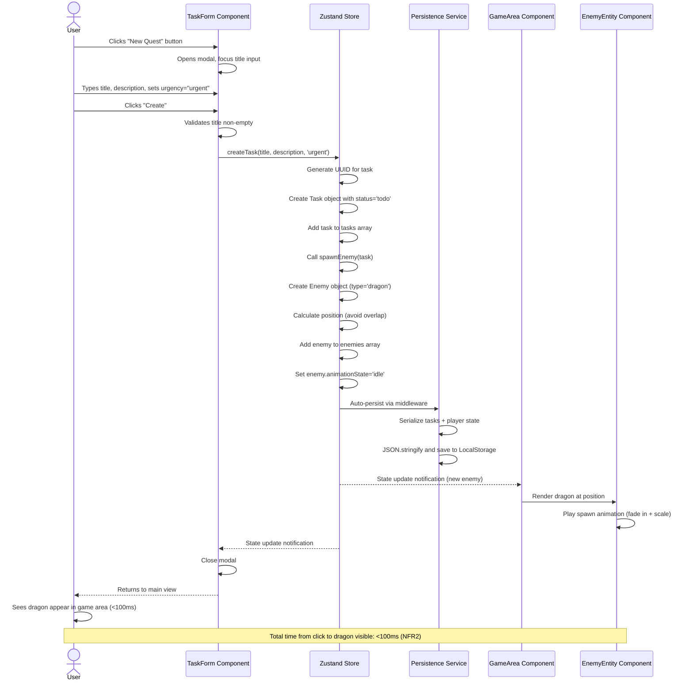
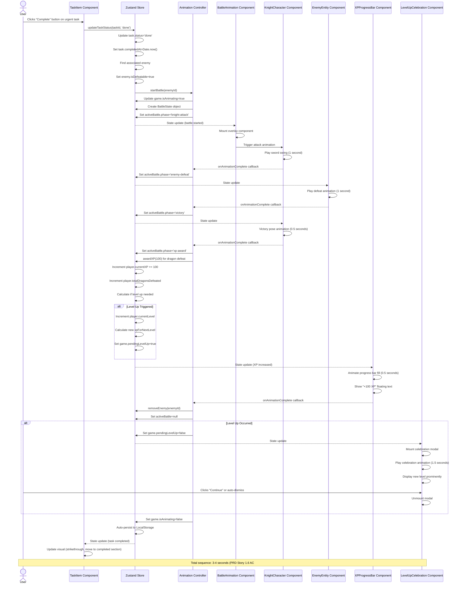
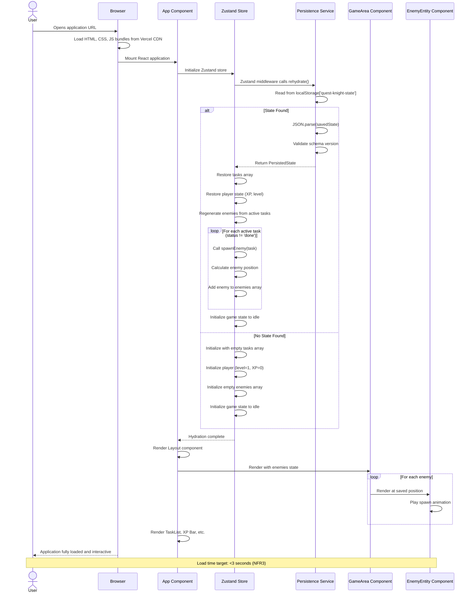

# Core Workflows

## Create Urgent Task and Spawn Dragon

This workflow demonstrates the immediate visual feedback loop (PRD NFR9: first "wow moment" within 90 seconds).

## Complete Task and Battle Animation Sequence

This is the core gamification loop - the most complex and critical workflow (PRD Story 1.6).

## Application Load and State Restoration

Demonstrates LocalStorage hydration and enemy regeneration from saved tasks.

