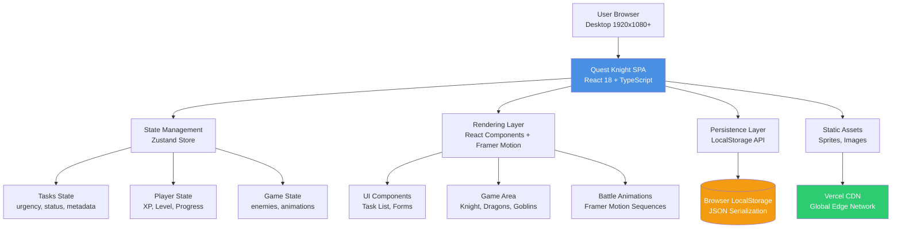

# High Level Architecture

## Technical Summary

Quest Knight implements a **client-side Single Page Application (SPA)** architecture using React 18 with TypeScript, deployed as static files to a CDN. The MVP employs a **pure frontend** approach with browser LocalStorage providing data persistence, eliminating backend infrastructure entirely. The application uses **Framer Motion** for GPU-accelerated battle animations and Zustand for global state management (tasks, user XP/level, game state). All business logic executes client-side in the browser, with no API calls or external dependencies beyond sprite assets served from the public directory. This architecture achieves the PRD's aggressive 5-7 day MVP timeline while establishing clear patterns for post-MVP backend integration. The static deployment approach enables instant global distribution via CDN edge locations.

## Platform and Infrastructure Choice

**Platform:** Vercel (Static Site Hosting)  
**Key Services:** 
- Vercel Edge Network (Global CDN)
- Vercel Analytics (Web Vitals monitoring)
- GitHub Integration (Automatic deployments from main branch)

**Deployment Host and Regions:** Global CDN with automatic edge deployment to 100+ worldwide locations

**Rationale:** Vercel provides zero-config deployment for Vite/React apps with automatic HTTPS, global CDN, and instant rollbacks. The free tier is sufficient for MVP demos, and there's a trivial path to Vercel Serverless Functions for post-MVP backend integration. The excellent developer experience aligns perfectly with the 5-7 day MVP timeline.

## Repository Structure

**Structure:** Monorepo (Single Package for MVP)  
**Monorepo Tool:** Not applicable (simple structure, no workspaces needed for MVP)  
**Package Organization:** Single `frontend/` app with clear internal directory structure

```
quest-knight/
├── frontend/              # React application (only package in MVP)
│   ├── src/
│   ├── public/
│   └── package.json
├── docs/                  # Project documentation
│   ├── prd.md
│   └── architecture.md
├── .github/workflows/     # CI/CD (Vercel auto-deploy)
├── package.json           # Root package file (minimal)
└── README.md
```

**Rationale:** For MVP, the backend directory is unnecessary since no backend code exists. The simple structure saves setup time and reduces complexity. A `backend/` directory can be added easily post-MVP if needed.

## High Level Architecture Diagram



## Architectural Patterns

- **Jamstack Architecture:** Static site generation with client-side hydration - _Rationale:_ Optimal performance, zero backend infrastructure for MVP, instant global distribution via CDN

- **Component-Based UI:** Reusable React functional components with TypeScript interfaces - _Rationale:_ Maintainability, type safety, and clear component boundaries for AI-driven development

- **Presentational/Container Pattern:** Separation of UI components from state logic - _Rationale:_ Enables independent testing of business logic and visual components

- **Repository Pattern (Client-Side):** Abstract LocalStorage operations behind service interfaces - _Rationale:_ Enables seamless migration to backend APIs post-MVP without changing component code

- **Optimistic UI Updates:** Immediate UI feedback before persistence completes - _Rationale:_ Sub-100ms interaction response time (NFR2) even with LocalStorage latency

- **State Machine Pattern:** Battle animation sequences as finite state machines - _Rationale:_ Complex animation flows (knight attack → dragon defeat → XP award → level up) require predictable state transitions

- **Factory Pattern:** Enemy creation based on task urgency - _Rationale:_ Clean abstraction for spawning dragons (urgent) vs. goblins (normal) from task properties

