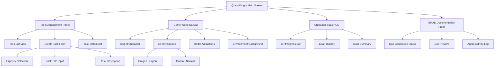
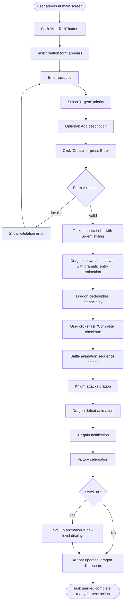
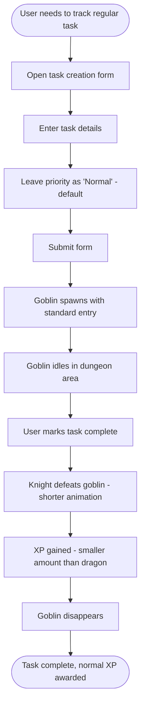
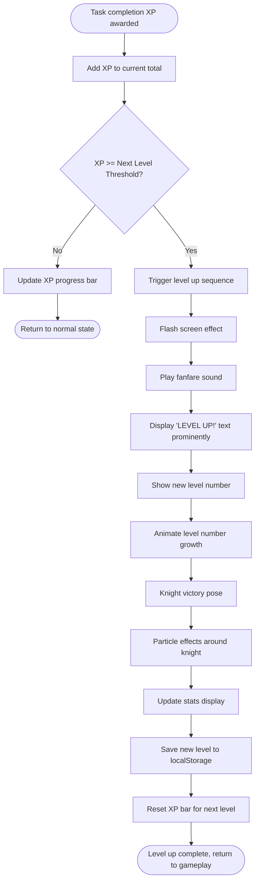
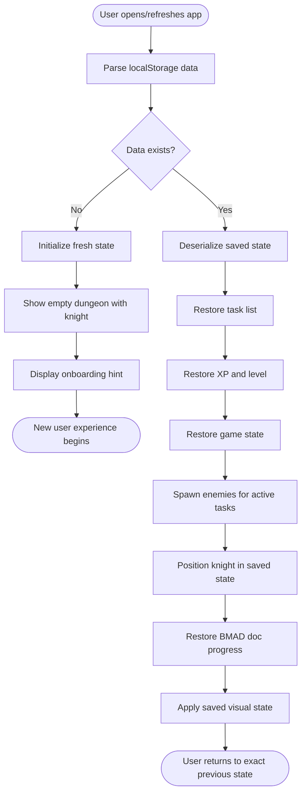
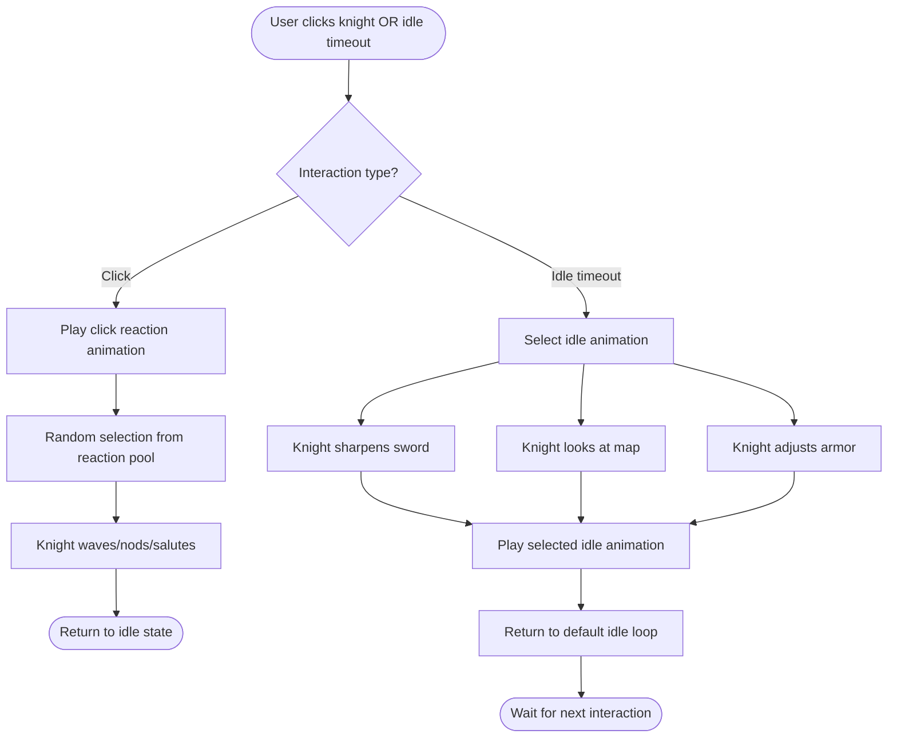

# Quest Knight UI/UX Specification

**Version:** 1.0  
**Date:** November 14, 2025  
**Status:** Draft  
**Project:** Quest Knight - Gamified Todo Application

---

## Introduction

This document defines the user experience goals, information architecture, user flows, and visual design specifications for Quest Knight's user interface. It serves as the foundation for visual design and frontend development, ensuring a cohesive and user-centered experience.

### Overall UX Goals & Principles

Quest Knight's user experience bridges two worlds: fantasy gaming and productivity management. Every design decision must serve both purposes while maintaining the illusion that this is primarily a game.

#### Target User Personas

**Primary: BMAD Framework Evaluators**
- Technical decision-makers (28-45 years old) evaluating BMAD capabilities
- Short attention spans (5-10 minutes before forming judgment)
- Need immediate "wow moments" and clear value demonstration
- Skeptical of marketing; prefer hands-on experience
- Looking for evidence of practical usefulness, not just novelty

**Secondary: Productivity Enthusiasts**
- Users seeking engaging alternatives to traditional todo apps
- Frustrated with engagement decay in standard productivity tools
- Appreciate gamification when meaningfully integrated
- Value both utility and emotional reward
- Daily task volume: 5-15 tasks

**Tertiary: Casual Gamers**
- Attracted by fantasy theme and progression mechanics
- Familiar with dungeon crawler and RPG conventions
- May discover productivity benefits through gameplay
- Expect smooth animations and satisfying feedback loops

#### Usability Goals

- **Instant Causality (90-second wow):** New users complete their first urgent task and witness a dragon battle within 90 seconds of launch, creating immediate emotional engagement
- **Sub-100ms Responsiveness:** Every user interaction triggers visual feedback within 100 milliseconds, maintaining game-like fluidity
- **Zero Learning Curve for Core Loop:** Task creation → enemy appearance → task completion → battle victory should be self-evident without tutorials
- **Sustained Daily Engagement:** 60%+ daily return rate in first week through meaningful progression and satisfying feedback loops
- **Clear BMAD Connection:** Users immediately understand how their task completion drives BMAD documentation generation
- **25% Completion Boost:** Users complete more tasks than with traditional apps due to dopamine-rich battle animations

#### Design Principles

1. **Game First, Tool Second** - The UI should feel like a game that happens to be productive, not a productivity tool with game decorations. Fantasy aesthetics, rich animations, and game mechanics take visual priority.

2. **Immediate Visual Consequence** - Every action must have an immediate, satisfying visual response. Creating a task spawns an enemy. Completing a task triggers battle. No action goes unrewarded.

3. **Meaningful Integration Over Decoration** - Gamification elements must directly affect gameplay. Task urgency determines enemy type and battle complexity, not just badge colors.

4. **Dopamine-Rich Feedback Loops** - Battle animations, XP gains, level-ups, and victory celebrations provide emotional payoff that keeps users returning. Prioritize satisfying moments over efficiency.

5. **Desktop Richness** - Leverage desktop screen space for simultaneous display of task list, game world, and BMAD documentation. Create complexity impossible on mobile-first designs.

#### Change Log

| Date | Version | Description | Author |
|------|---------|-------------|---------|
| November 14, 2025 | v1.0 | Initial UI/UX specification created | Sally (UX Expert) |

---

## Information Architecture (IA)

Quest Knight's information architecture reflects its dual nature as both game and productivity tool, with a single-screen layout that keeps all key elements visible simultaneously on desktop displays.

### Site Map / Screen Inventory



### Navigation Structure

**Primary Navigation:** Single-screen layout with no traditional navigation - all functionality accessible from main view

**Panel Organization:**
- **Left Panel (30% width):** Task Management - scrollable task list with create/edit forms appearing inline or as modals
- **Center Canvas (50% width):** Game World - the knight character, enemies, battle animations, and dungeon environment
- **Right Panel (20% width):** Split between Character Stats HUD (top) and BMAD Documentation Panel (bottom)

**Interaction Flow:**
- Users interact primarily with task list (left) and game canvas (center)
- Task creation immediately spawns visible enemy in game canvas
- Task completion triggers battle animation in center canvas
- Stats and documentation update reactively as side effects
- No screen transitions or page navigation required

**Breadcrumb Strategy:** Not applicable - single-screen application with persistent state visibility

**Responsive Strategy (Desktop-First):**
- **1920x1080 (Standard):** Three-column layout as described above
- **2560x1440+ (Large Desktop):** Expanded canvas with larger character sprites and more enemy positioning space
- **1366x768 (Minimum):** Compressed panels with collapsible documentation section
- **Mobile/Tablet (Future):** Complete redesign required - not part of MVP scope

---

## User Flows

Quest Knight's user flows center around the core task-battle loop and progression mechanics. Each flow emphasizes immediate visual feedback and clear causality between actions and consequences.

### Flow 1: Create Urgent Task & Witness Dragon Battle (Primary "Wow Moment")

**User Goal:** Create a new urgent task and experience the dragon battle sequence

**Entry Points:** 
- First-time user onboarding
- Main screen task list "Add Task" button
- Keyboard shortcut (Ctrl/Cmd + N)

**Success Criteria:** 
- Task created and saved to localStorage
- Dragon enemy appears on game canvas within 100ms
- User understands connection between urgent task and dragon enemy

#### Flow Diagram



#### Edge Cases & Error Handling:
- **Empty title:** Form validation prevents submission, highlights title field
- **Multiple urgent tasks:** Multiple dragons appear with spatial positioning to avoid overlap (FR17)
- **Task completion during battle animation:** Queue completion action until current animation finishes
- **Browser tab loses focus during animation:** Animation pauses and resumes on focus return
- **localStorage quota exceeded:** Show error modal with option to clear completed tasks

**Notes:** This is the single most critical flow - must execute flawlessly within 90 seconds for new users per NFR9.

---

### Flow 2: Create Normal Task & Complete Quest

**User Goal:** Add a regular (non-urgent) task and complete it efficiently

**Entry Points:**
- Main screen "Add Task" button
- Keyboard shortcut (Ctrl/Cmd + N)
- During task batch creation

**Success Criteria:**
- Task created with normal priority
- Goblin enemy appears immediately
- Battle animation plays on completion with appropriate XP reward

#### Flow Diagram



#### Edge Cases & Error Handling:
- **Many normal tasks:** Goblins group together visually to avoid canvas clutter
- **Normal task upgraded to urgent:** Goblin morphs into dragon with transformation animation
- **Task unmarked as complete:** Enemy respawns with return animation
- **Simultaneous completions:** Battle animations queue and play in rapid sequence

**Notes:** This flow emphasizes efficiency - simpler animation, faster completion for bulk task management.

---

### Flow 3: Level Up Sequence

**User Goal:** Gain enough XP to level up and receive celebration feedback

**Entry Points:**
- Completing any task when near level threshold
- Multiple task completions in sequence

**Success Criteria:**
- XP accumulation triggers level up at threshold
- Celebration animation plays immediately
- New level persists to localStorage

#### Flow Diagram



#### Edge Cases & Error Handling:
- **Multiple level ups from single task:** Play level up sequence for each level gained (rare but possible with large XP rewards)
- **Level up during battle animation:** Queue level up to play immediately after battle concludes
- **Browser closed during level up:** Level persists correctly; animation can be skipped on reload
- **XP calculation error:** Validate XP math, log errors, prevent negative XP

**Notes:** Level up is a key dopamine moment - must feel celebratory and significant per NFR10.

---

### Flow 4: Application Load & State Restoration

**User Goal:** Return to the application and resume exactly where they left off

**Entry Points:**
- Opening application URL in browser
- Refreshing browser tab
- Returning after browser restart

**Success Criteria:**
- All tasks restore from localStorage (FR14)
- Knight and enemies appear in correct states
- XP, level, and progress restore accurately
- BMAD documentation state restores

#### Flow Diagram



#### Edge Cases & Error Handling:
- **Corrupted localStorage:** Detect invalid JSON, show recovery options (reset or backup restore)
- **Version mismatch:** Migrate old state format to new schema automatically
- **Partial data loss:** Restore what's recoverable, fill gaps with defaults
- **Very large task lists:** Lazy load/paginate tasks if count exceeds performance threshold
- **Enemy position conflicts:** Recalculate spatial positioning if saved positions overlap

**Notes:** Seamless state restoration is critical for daily engagement - users must trust their progress persists per NFR7.

---

### Flow 5: Interact with Knight Character

**User Goal:** Click/interact with knight to see personality and idle animations

**Entry Points:**
- Clicking knight character sprite
- Knight idle timeout (after 30 seconds no activity)
- After completing tasks

**Success Criteria:**
- Knight responds to clicks with reaction animations
- Idle animations play automatically to maintain life/personality
- Interactions feel responsive and delightful

#### Flow Diagram



#### Edge Cases & Error Handling:
- **Click during battle:** Ignore click, battle animations take priority
- **Rapid clicking:** Debounce clicks to prevent animation stacking
- **Animation interruption:** Allow animations to complete before triggering new ones
- **Multiple idle animations queued:** Clear queue, play most recent only

**Notes:** Supports FR11 and FR12 - adds personality and encourages casual interaction with knight character.

---

## Wireframes & Mockups

Quest Knight's visual design will be created in a dedicated design tool with references linked below. This section provides conceptual layouts for key screens to guide the detailed design work.

### Primary Design Files

**Primary Design Files:** [Figma Project Link - To be created]

**Design Tool:** Figma (recommended for web-based collaboration and developer handoff)

**Artboard Dimensions:**
- Standard Desktop: 1920x1080px
- Large Desktop: 2560x1440px
- Minimum Desktop: 1366x768px

---

### Key Screen Layouts

#### Main Game Screen (Single View Application)

**Purpose:** The primary and only screen in Quest Knight MVP - displays all functionality simultaneously

**Key Elements:**

**Header Bar (Full Width, 60px height):**
- App logo/title: "Quest Knight" with fantasy typography
- Quick stats summary: Level badge, current XP count
- Settings icon (future: sound toggle, preferences)

**Left Panel - Task Management (30% width, ~576px):**
- "Create New Quest" button (prominent, styled as scroll/banner)
- Task list with cards showing:
  - Task title
  - Urgency indicator (dragon icon for urgent, sword icon for normal)
  - Status (todo/in-progress/done)
  - Complete checkbox styled as quest completion stamp
- Scroll container for long task lists
- Visual urgency differentiation: urgent tasks have red/gold borders, normal tasks have standard styling

**Center Canvas - Game World (50% width, ~960px):**
- Dungeon/castle environment background (parallax layers for depth)
- Knight character sprite (positioned lower-left, ~200x200px animated sprite)
- Enemy entities positioned dynamically:
  - Dragons: larger sprites (~250x250px), positioned prominently
  - Goblins: smaller sprites (~150x150px), grouped if multiple
- Battle animation overlay space (full canvas dimensions)
- Particle effects layer for magic, fire, victory sparkles
- Foreground elements: stone pillars, dungeon props for atmosphere

**Right Panel - Stats & Documentation (20% width, ~384px):**

**Top Half - Character Stats HUD:**
- Large level display: "LEVEL 5" with knight helmet icon
- XP Progress Bar:
  - Current XP / Next Level XP
  - Visual fill animation
  - Glowing effect when near level up
- Mini stats:
  - Tasks completed today
  - Total quests conquered
  - Win streak indicator

**Bottom Half - BMAD Documentation Panel:**
- Panel header: "Quest Journal" (BMAD branding subtle)
- Live documentation preview:
  - Agent activity indicator ("Analyst is writing...")
  - Recent document snippets
  - Progress indicator for doc generation
- Expand button to view full documentation

**Interaction Notes:**

- **Task Creation:** Clicking "Create New Quest" expands inline form OR shows modal overlay
- **Task Completion:** Clicking completion checkbox triggers immediate battle animation in center canvas
- **Knight Interaction:** Clicking knight character triggers reaction animation
- **Enemy Hover:** Hovering enemy shows associated task tooltip
- **Panel Resizing:** Drag handles between panels allow users to adjust widths (preference saved)

**Design File Reference:** [Main-Screen-Full-Layout] (to be created in Figma)

---

#### Task Creation Form (Modal/Inline Component)

**Purpose:** Capture task details and urgency when user creates new quest

**Key Elements:**

**Form Container (Modal: 500x400px OR Inline in left panel):**
- **Title:** "Create New Quest" with decorative scroll banner
- **Task Title Input:**
  - Text field labeled "Quest Name"
  - Placeholder: "What dragon shall you slay today?"
  - Character limit indicator (optional: 60 chars)
- **Urgency Selection:**
  - Radio buttons OR toggle styled as quest priority flags
  - "Urgent" option: Red dragon icon, "Face the Dragon!"
  - "Normal" option: Green goblin icon, "Handle the Minions"
  - Default: Normal
- **Task Description (Optional):**
  - Text area labeled "Quest Details"
  - Placeholder: "Additional notes about this quest..."
  - Expandable, up to 500 characters
- **Action Buttons:**
  - Primary: "Accept Quest" (CTA button, fantasy styled)
  - Secondary: "Cancel" (subtle text link)

**Interaction Notes:**

- Form appears with title field auto-focused
- Enter key submits form
- ESC key cancels/closes
- Real-time validation shows errors inline
- Urgency selection triggers visual preview (dragon silhouette vs goblin silhouette)

**Design File Reference:** [Task-Creation-Modal] (to be created in Figma)

---

#### Battle Animation Sequence (Overlay on Game Canvas)

**Purpose:** Provide satisfying visual feedback for task completion with battle animation

**Key Elements:**

**Phase 1 - Battle Initiation (0.5 seconds):**
- Knight character moves toward enemy
- Camera zooms slightly on combatants
- Battle music/SFX begins
- UI dims slightly to focus attention

**Phase 2 - Combat (1.5 seconds):**
- Knight attack animation:
  - Sword swing with motion blur
  - Attack particle effects (slashes, impacts)
- Enemy reaction:
  - Dragon: roars, breathes fire, takes damage
  - Goblin: stumbles, swings weapon weakly
- Hit effects: screen shake, flash, particles

**Phase 3 - Victory (1.5 seconds):**
- Enemy defeat animation:
  - Dragon: dramatic fall with explosion
  - Goblin: comical tumble
- Knight victory pose
- XP Gain notification appears:
  - "+50 XP" floats upward with glow
  - XP bar fills with animation
- Gold coins/loot particles (visual only for MVP)

**Phase 4 - Return (0.5 seconds):**
- Camera zooms back to normal view
- UI restores to full visibility
- Enemy disappears, task marked complete
- If level up: transition to level up sequence

**Interaction Notes:**

- Total animation: 4 seconds for dragons, 2.5 seconds for goblins
- Non-blocking: UI remains responsive, other tasks can be created during battle
- Skippable: Click/ESC skips to final frame (preserves XP gain)
- Multiple battles: Queue animations, play in rapid sequence with 0.3s gaps

**Design File Reference:** [Battle-Animation-Storyboard] (to be created in Figma/After Effects)

---

#### Level Up Celebration (Full Screen Overlay)

**Purpose:** Celebrate user achievement when reaching new level

**Key Elements:**

**Full Screen Overlay (dimmed background, 1920x1080):**
- Central focus: Large "LEVEL UP!" text
  - Animated with scale/glow effects
  - Fantasy typography with gold/particle effects
- New Level Display:
  - "LEVEL 5" in prominent numbers
  - Animated count-up from previous level
- Knight Character:
  - Center-stage position
  - Victory animation (sword raised, triumphant pose)
  - Particle effects: sparkles, light rays, magic aura
- Stats Summary (optional):
  - Total XP earned
  - Total quests completed
  - Current win streak
- Continue Button:
  - "Continue Your Journey" CTA
  - Auto-dismiss after 5 seconds OR on click

**Interaction Notes:**

- Appears immediately after XP threshold crossed
- Blocks other interactions (intentional celebration moment)
- Can be dismissed early with click/Enter/ESC
- Fanfare sound effect plays (if audio enabled)
- Level persists to localStorage before animation begins

**Design File Reference:** [Level-Up-Overlay] (to be created in Figma)

---

#### First-Time User Onboarding (Overlay Hints)

**Purpose:** Guide new users to their first dragon battle within 90 seconds

**Key Elements:**

**Onboarding Sequence (Progressive hints, not blocking tutorial):**

**Hint 1 - Welcome (Auto-appears on first load):**
- Tooltip pointing to "Create New Quest" button
- Text: "Welcome, Knight! Create your first quest to begin your adventure."
- Dismiss: Click button OR close tooltip

**Hint 2 - Urgency Selection (Appears in creation form):**
- Tooltip pointing to "Urgent" option
- Text: "Mark this urgent to face a mighty dragon!"
- Dismiss: Select any option

**Hint 3 - Complete Task (Appears after task created):**
- Tooltip pointing to completion checkbox
- Text: "Complete your quest to battle the dragon!"
- Dismiss: Click checkbox

**Hint 4 - Victory (Appears after first battle):**
- Celebration message: "You defeated the dragon! Create more quests to level up."
- Dismiss: Auto-dismiss after 3 seconds

**Interaction Notes:**

- Minimal, non-blocking onboarding
- Users can skip all hints and discover naturally
- Hints only appear once, never repeated
- Onboarding state saved to localStorage
- Total onboarding time: <30 seconds if followed

**Design File Reference:** [Onboarding-Hints] (to be created in Figma)

---

## Component Library / Design System

Quest Knight requires a custom fantasy-themed design system that balances game aesthetics with functional UI patterns. Rather than using a standard design system like Material Design or Bootstrap, we'll create a bespoke component library that reinforces the medieval fantasy theme while maintaining usability.

### Design System Approach

**Design System Approach:** Custom component library built specifically for Quest Knight

**Rationale:** 
- Existing design systems (Material, Bootstrap, Ant Design) have modern/corporate aesthetics that conflict with fantasy gaming theme
- Custom approach allows tight integration of game elements (health bars become XP bars, buttons become scrolls/banners)
- Smaller scope (single-screen app) makes custom system feasible within MVP timeline
- Components can be built in React with styled-components or CSS modules for full styling control

**Component Documentation:**
- Storybook for isolated component development and documentation
- Each component includes multiple states, variants, and usage examples
- Accessibility notes documented per component

**Foundation Elements:**
- Color palette (defined in Branding section below)
- Typography system (defined in Branding section below)
- Spacing scale: 4px base unit (4, 8, 12, 16, 24, 32, 48, 64px)
- Border radius scale: 4px (subtle), 8px (standard), 16px (prominent)
- Shadow system: Subtle elevation with fantasy-appropriate drop shadows

---

### Core Components

#### Button Component

**Purpose:** Primary interactive element for all user actions

**Variants:**
- **Primary (CTA):** Large, prominent button for main actions ("Accept Quest", "Continue Your Journey")
  - Styled as medieval banner/scroll with parchment texture
  - Gold/brass accents with subtle emboss
  - Hover: Glow effect, slight scale increase
  
- **Secondary:** Less prominent actions ("Cancel", "View Details")
  - Simpler styling, stone/wood texture
  - Silver/iron accents
  - Hover: Subtle brightening
  
- **Icon Button:** Small circular buttons for utility actions (settings, close)
  - Medieval shield or coin shape
  - Icon centered within shape
  - Hover: Rotate slightly, brighten

**States:**
- **Default:** Normal appearance
- **Hover:** Glow effect, cursor changes to fantasy pointer (sword icon)
- **Active/Pressed:** Slight scale down (0.95), darker shading
- **Disabled:** Desaturated, faded opacity (0.5), cursor not-allowed
- **Loading:** Spinning medieval loading indicator (spinning sword/shield)

**Usage Guidelines:**
- Use Primary for single most important action per context
- Maximum one Primary button per screen/modal
- Icon buttons for non-critical utility actions only
- Always include hover states for tactile feedback
- Ensure touch targets minimum 44x44px (even on desktop for accessibility)

**Accessibility:**
- ARIA labels on icon-only buttons
- Focus indicators: glowing border with fantasy aesthetic
- Keyboard navigation: Enter/Space triggers action

---

#### Input Field Component

**Purpose:** Text entry for task titles, descriptions, and other user input

**Variants:**
- **Text Input (Single Line):** Task titles, short entries
  - Styled as engraved stone tablet or parchment scroll
  - Medieval serif font for user input
  - Label above input with fantasy typography
  
- **Text Area (Multi-Line):** Task descriptions, longer content
  - Parchment background texture
  - Scrollable for overflow
  - Expands slightly on focus
  
- **Select/Dropdown:** Urgency selection, filters
  - Styled as medieval dropdown menu
  - Custom arrow icon (downward sword or chevron)

**States:**
- **Default:** Subtle border, placeholder text in muted color
- **Focus:** Glowing border (gold/blue magical effect), placeholder fades
- **Filled:** User content displayed, label remains visible
- **Error:** Red glow, error message below in red text
- **Disabled:** Grayed out, faded, no interaction
- **Read-Only:** Darker background, no border glow on focus

**Usage Guidelines:**
- Keep labels clear and concise
- Use placeholder text for format examples, not critical instructions
- Show character count for limited fields
- Real-time validation with inline error messages
- Error states should guide users to fix issues

**Accessibility:**
- Proper label-input association
- Error messages announced to screen readers
- Required fields indicated with asterisk and ARIA
- High contrast between text and background

---

#### Task Card Component

**Purpose:** Display individual tasks in the task list with status and urgency

**Variants:**
- **Urgent Task Card:** 
  - Red/gold border with dragon icon
  - Slightly larger, more prominent
  - Pulsing glow effect if not completed
  
- **Normal Task Card:**
  - Standard border with sword icon
  - Neutral styling
  
- **Completed Task Card:**
  - Faded/desaturated
  - Checkmark or "COMPLETED" stamp overlay
  - Strikethrough text effect

**States:**
- **Todo:** Full color, active appearance
- **In Progress:** Blue accent, slight animation (shimmer)
- **Done:** Desaturated, stamp overlay
- **Hover:** Slight elevation, shadow increases
- **Selected:** Border highlights, background brightens

**Usage Guidelines:**
- Show urgency prominently with color and icon
- Completion checkbox should be large and easy to click
- Hover reveals additional actions (edit, delete icons)
- Cards stack with 12px gap between them
- Maximum width: ~540px to prevent overly long lines

**Accessibility:**
- Entire card is clickable/focusable region
- Checkbox separately focusable for keyboard users
- Status changes announced to screen readers
- Color not sole indicator of urgency (icon + text also present)

---

#### Progress Bar Component

**Purpose:** Show XP progression toward next level

**Variants:**
- **XP Progress Bar (Primary Use):**
  - Medieval style: styled as ornate bar with metal frame
  - Fill animation: smooth liquid effect with particles
  - Label shows "X / Y XP" or "45% to Level 6"
  
- **Loading Progress Bar (Secondary Use):**
  - Simpler style for generic loading states
  - Indeterminate variant with animated pattern

**States:**
- **Filling:** Smooth animation from current % to new %
- **Nearly Full (90%+):** Glowing effect, pulsing to indicate level up imminent
- **Level Up:** Flash effect, empties and restarts for next level
- **Empty:** Neutral state at 0%

**Usage Guidelines:**
- Always visible in stats HUD
- Show numerical values alongside visual bar
- Animate fill changes over 0.5-1 second for satisfying feedback
- Near level-up state should create anticipation

**Accessibility:**
- ARIA role="progressbar" with value/min/max
- Text alternative showing percentage or fraction
- Status updates announced to screen readers

---

#### Modal/Dialog Component

**Purpose:** Overlay content for focused interactions (task creation, confirmations, level ups)

**Variants:**
- **Small Modal (400x300px):** Confirmations, simple prompts
- **Medium Modal (600x500px):** Task creation, complex forms
- **Large Modal (800x600px):** Documentation preview, detailed views
- **Full Screen Overlay:** Level up celebrations, major announcements

**States:**
- **Opening:** Fade in with scale animation (starts at 0.9, grows to 1.0)
- **Open:** Fully visible, background dimmed (overlay)
- **Closing:** Fade out with scale animation (shrinks to 0.9)

**Usage Guidelines:**
- Use sparingly - prefer inline interactions when possible
- Always include clear close mechanism (X button + ESC key)
- Background dim should be subtle but clear (0.6 opacity black)
- Modal content should be scrollable if exceeds viewport
- Primary action in footer (right-aligned in Western layouts)

**Accessibility:**
- Focus trap: keyboard focus stays within modal
- ESC key closes modal
- Focus returns to trigger element on close
- ARIA role="dialog" with aria-labelledby
- Background content inert (aria-hidden)

---

#### Badge/Label Component

**Purpose:** Small visual indicators for status, counts, or categories

**Variants:**
- **Status Badge:** Task urgency, completion status
  - "URGENT" in red with dragon icon
  - "NORMAL" in gray with sword icon
  - "DONE" in green with checkmark
  
- **Count Badge:** Notification counts, task counts
  - Small circular badge with number
  - Positioned on icons or buttons
  
- **Level Badge:** Player level display
  - Shield or banner shape
  - Large number with "LVL" prefix

**States:**
- **Default:** Static display
- **Animated:** Pulse effect for attention (new notifications)
- **Updated:** Brief flash when value changes

**Usage Guidelines:**
- Use for supplementary information, not primary content
- Keep text short (1-15 characters max)
- High contrast for readability
- Position consistently relative to parent element

**Accessibility:**
- Meaningful badges included in screen reader text
- Decorative badges hidden from assistive tech
- Status changes announced when relevant

---

#### Tooltip Component

**Purpose:** Provide contextual help and additional information on hover

**Variants:**
- **Info Tooltip:** Helpful hints, explanations
  - Small popup with arrow pointing to trigger
  - Parchment style with readable text
  
- **Help Tooltip:** Onboarding hints, tutorial steps
  - Larger, more prominent
  - Can include "Got it" dismiss button

**States:**
- **Hidden:** Default state, not visible
- **Showing:** Appears on hover/focus after 0.5s delay
- **Persistent:** Remains visible until dismissed (help tooltips)

**Usage Guidelines:**
- Appear on hover after brief delay (500ms)
- Dismiss on mouse leave or ESC key
- Position dynamically to avoid viewport edges
- Keep content concise (1-2 sentences max)
- Don't hide critical information in tooltips

**Accessibility:**
- ARIA-describedby links tooltip to trigger
- Keyboard accessible (focus triggers tooltip)
- Screen reader compatible text
- Not for critical interactive content

---

#### Notification/Toast Component

**Purpose:** Temporary alerts and confirmations for user actions

**Variants:**
- **Success Toast:** "Task completed!", "Progress saved"
  - Green/gold coloring with checkmark icon
  - Auto-dismiss after 3 seconds
  
- **Error Toast:** "Failed to save", validation errors
  - Red coloring with warning icon
  - Longer persistence (5 seconds) or manual dismiss
  
- **Info Toast:** General notifications, tips
  - Blue coloring with info icon
  - Auto-dismiss after 4 seconds

**States:**
- **Entering:** Slide in from top-right corner
- **Visible:** Fully displayed with countdown timer
- **Exiting:** Fade out and slide away

**Usage Guidelines:**
- Stack multiple toasts vertically with 8px gap
- Maximum 3 visible simultaneously
- Include icon to reinforce message type
- Brief, actionable messages
- Allow manual dismiss (X button)

**Accessibility:**
- ARIA role="alert" for important messages
- Announced to screen readers automatically
- Keyboard focusable for dismiss action
- Color + icon convey meaning (not color alone)

---

## Branding & Style Guide

Quest Knight's visual identity blends medieval fantasy aesthetics with modern UI clarity. The brand should feel like stepping into a dungeon crawler game while maintaining the usability standards of a professional productivity tool.

### Visual Identity

**Brand Guidelines:** [Quest Knight Brand Guide - To be created]

**Brand Personality:**
- **Epic:** Grand fantasy adventure with heroic themes
- **Playful:** Not taking itself too seriously - fun over realism
- **Rewarding:** Every interaction feels like an achievement
- **Nostalgic:** Evokes classic 16-bit RPG and dungeon crawler games

**Visual Direction:**
- Medieval fantasy with slight cartoon/stylized rendering (not photorealistic)
- Rich textures: stone, parchment, metal, wood
- Vibrant colors with high saturation for energy and excitement
- Particle effects and subtle animations throughout
- Hand-drawn or painterly style for characters and environments

**Reference Inspirations:**
- Classic 16-bit RPGs (Final Fantasy, Chrono Trigger) for nostalgic feel
- Modern indie games (Slay the Spire, Darkest Dungeon) for UI clarity
- Hearthstone for playful fantasy aesthetic
- Stardew Valley for approachable pixel art style

---

### Color Palette

| Color Type | Hex Code | Usage |
|------------|----------|-------|
| Primary | `#D4AF37` (Gold) | Primary buttons, highlights, XP gains, victory moments |
| Secondary | `#8B4513` (Saddle Brown) | Secondary buttons, wood textures, neutral elements |
| Accent | `#FF6B35` (Orange Red) | Urgent indicators, dragon elements, call-to-action highlights |
| Success | `#2ECC71` (Emerald) | Task completion, positive feedback, health/stamina indicators |
| Warning | `#F39C12` (Orange) | Cautions, important notices, medium priority indicators |
| Error | `#E74C3C` (Alizarin) | Errors, destructive actions, danger indicators |
| Neutral Dark | `#2C3E50` (Midnight Blue) | Primary text, dark UI elements, shadows |
| Neutral Mid | `#7F8C8D` (Asbestos) | Secondary text, borders, dividers |
| Neutral Light | `#ECF0F1` (Clouds) | Backgrounds, cards, light surfaces |
| Magic Blue | `#3498DB` (Peter River) | Magical effects, level up celebrations, special abilities |
| Dragon Red | `#C0392B` (Pomegranate) | Dragon-specific elements, urgent task borders |
| Goblin Green | `#27AE60` (Nephritis) | Goblin-specific elements, normal task accents |

**Color Application Notes:**
- **Primary Gold:** Use sparingly for emphasis - buttons, rewards, level numbers
- **Accent Orange/Red:** Reserved for urgent/critical elements only
- **Success Green:** All completion states, positive reinforcement
- **Neutral palette:** 60% of UI should use neutral colors for clarity
- **Entity colors:** Dragon Red and Goblin Green create clear enemy differentiation
- **Magic Blue:** Special moments like level ups, ability unlocks (future)

**Contrast Requirements:**
- All text meets WCAG AA standards (4.5:1 for normal text, 3:1 for large)
- Interactive elements have clear hover/focus states with visible contrast
- Color alone never conveys meaning - always paired with icons or text

---

### Typography

#### Font Families

- **Primary (Headings/Display):** "Cinzel" or "Uncial Antiqua" - Medieval serif for fantasy feel
  - Fallback: Georgia, "Times New Roman", serif
  - Use for: Headlines, level numbers, victory text, brand name
  - Weight: Bold (700) for emphasis

- **Secondary (Body/UI):** "Lato" or "Open Sans" - Clean sans-serif for readability
  - Fallback: Arial, Helvetica, sans-serif
  - Use for: Body text, task descriptions, UI labels, buttons
  - Weights: Regular (400), Bold (700)

- **Monospace (Technical):** "Fira Code" or "Consolas" - For code/data displays
  - Fallback: "Courier New", monospace
  - Use for: XP numbers, stats, debug info, BMAD code previews
  - Weight: Regular (400)

**Font Loading Strategy:**
- Use Google Fonts or self-hosted web fonts
- Implement font-display: swap for faster initial render
- Ensure fallback fonts maintain similar x-height and spacing

#### Type Scale

| Element | Size | Weight | Line Height | Usage |
|---------|------|--------|-------------|--------|
| H1 | 48px / 3rem | Bold (700) | 1.2 | Page title, "LEVEL UP!" announcements |
| H2 | 36px / 2.25rem | Bold (700) | 1.3 | Section headers, major UI areas |
| H3 | 24px / 1.5rem | Bold (700) | 1.4 | Card headers, modal titles |
| Body | 16px / 1rem | Regular (400) | 1.6 | Task descriptions, general content |
| Small | 14px / 0.875rem | Regular (400) | 1.5 | Secondary info, tooltips, metadata |
| Tiny | 12px / 0.75rem | Regular (400) | 1.4 | Timestamps, fine print, tertiary info |
| Button | 18px / 1.125rem | Bold (700) | 1 | Button text, CTAs |
| Display | 72px / 4.5rem | Bold (700) | 1.1 | Level numbers, epic announcements |

**Typography Guidelines:**
- Maintain consistent vertical rhythm using 8px baseline grid
- Limit line length to 60-80 characters for readability
- Use sentence case for UI elements, title case for headings
- Add letter-spacing to uppercase text for legibility (+0.05em)
- Scale font sizes proportionally on smaller screens

---

### Iconography

**Icon Library:** Custom icon set OR Font Awesome (fantasy/gaming subset)

**Primary Icon Sources:**
- **Option 1 (Recommended):** Commission custom pixel art icon set (16x16, 32x32) matching game aesthetic
- **Option 2:** Game-icons.net - Free fantasy/RPG icon library with medieval theme
- **Option 3:** Font Awesome Pro - Gaming and fantasy icon subset

**Icon Style:**
- Match visual style: pixel art OR simple line icons with fantasy embellishments
- Consistent stroke width: 2px for line icons
- Filled variants for active states, outlined for inactive
- Size variants: 16px (small), 24px (standard), 32px (large), 48px (hero)

**Core Icon Set (Required for MVP):**
- **Dragon:** Urgent task indicator, enemy sprite placeholder
- **Goblin/Sword:** Normal task indicator, standard enemy
- **Shield:** Level badge, defense stats
- **Crossed Swords:** Battle/combat indicator
- **Treasure Chest:** Rewards, loot (future feature)
- **Scroll:** Documentation, quest log, BMAD panel
- **Star/Sparkle:** XP gain, level up, celebration
- **Checkmark:** Task completion
- **Plus/Add:** Create new task
- **X/Close:** Dismiss, cancel, delete
- **Gear/Settings:** Configuration, preferences
- **Question Mark:** Help, tooltips
- **Heart:** Health (future feature)
- **Lightning Bolt:** Energy, urgency indicator

**Usage Guidelines:**
- Icons always paired with text labels for clarity (except icon-only buttons with aria-labels)
- Use consistent icon size within context (e.g., all task card icons = 24px)
- Apply color strategically: gold for rewards, red for urgent, green for complete
- Animate icons on state changes (scale, rotate, glow effects)
- Ensure icons are recognizable at smallest size (16px test)

---

### Spacing & Layout

**Grid System:** 12-column grid with fluid container

**Container Widths:**
- Desktop Standard (1920px): 1800px max content width (60px margins)
- Large Desktop (2560px): 2400px max content width (80px margins)
- Minimum Desktop (1366px): 1280px max content width (43px margins)

**Layout Proportions (Three-Panel):**
- Left Panel: 30% (min 480px, max 640px)
- Center Canvas: 50% (flexible, grows with viewport)
- Right Panel: 20% (min 320px, max 480px)
- Gutters between panels: 16px

**Spacing Scale (8px base unit):**
- **XXS:** 4px - Tight spacing, icon padding
- **XS:** 8px - Component internal spacing
- **S:** 12px - Related elements, card padding
- **M:** 16px - Standard gap, panel gutters
- **L:** 24px - Section separation
- **XL:** 32px - Major section breaks
- **XXL:** 48px - Page-level spacing
- **XXXL:** 64px - Hero sections, dramatic spacing

**Application Guidelines:**
- Use spacing scale consistently - no arbitrary values
- Maintain vertical rhythm with 8px baseline grid
- Card padding: 16px standard, 24px for large cards
- Button padding: 12px vertical, 24px horizontal
- Input padding: 12px all sides
- Stack spacing: 12px between related items, 24px between groups

**Layout Patterns:**
- **Panel headers:** 48px height, 16px padding
- **Task cards:** 12px gap in vertical stack
- **Form fields:** 16px vertical gap between inputs
- **Button groups:** 8px horizontal gap between buttons
- **Modal padding:** 24px all sides for content area

**Responsive Breakpoints:**
- Large Desktop: 2560px+
- Standard Desktop: 1920px - 2559px
- Small Desktop: 1366px - 1919px
- Below 1366px: Not optimized for MVP (show warning message)

---

## Accessibility Requirements

Quest Knight must be accessible to users with disabilities while maintaining its rich visual and interactive experience. Gaming applications historically struggle with accessibility, but we're committed to inclusive design from the start.

### Compliance Target

**Standard:** WCAG 2.1 Level AA compliance

**Rationale:**
- Level AA is the industry standard for web applications and legally required in many jurisdictions
- Level AAA requirements would conflict with game aesthetics (e.g., restrictions on animations, contrast ratios that preclude fantasy color palettes)
- Level AA balances accessibility with creative freedom for gaming experience

**Scope:**
- All UI controls and task management features must meet AA standards
- Game canvas animations receive best-effort accessibility considerations
- Documentation panel must be fully accessible as it represents BMAD's core value

**Testing Commitment:**
- Automated testing with aXe or WAVE for each component
- Manual keyboard navigation testing for all flows
- Screen reader testing with NVDA (Windows) and VoiceOver (macOS)
- User testing with at least one person from disability community before launch

---

### Key Requirements

#### Visual

**Color contrast ratios:**
- **Normal text (< 18px):** Minimum 4.5:1 contrast against background
  - Task titles, descriptions, body text: #2C3E50 on #ECF0F1 = 9.2:1 ✓
  - Button text: #FFFFFF on #D4AF37 = 4.6:1 ✓
  - Error messages: #E74C3C on #FFFFFF = 4.5:1 ✓
- **Large text (≥ 18px):** Minimum 3:1 contrast against background
  - Headings, level numbers, display text
- **UI components:** Minimum 3:1 contrast for interactive elements
  - Button borders, input fields, focus indicators
  - Dragon/goblin sprites must contrast with dungeon background
- **Exceptions:** Decorative elements (particle effects, atmospheric animations) can have lower contrast

**Focus indicators:**
- All interactive elements have visible focus state
- Focus ring: 2px solid gold (#D4AF37) with 2px offset
- Focus indicator visible on all backgrounds (dark outline on light backgrounds, light outline on dark)
- Custom fantasy-styled focus (glowing border effect) meets 3:1 contrast minimum
- Never remove focus indicators with CSS

**Text sizing:**
- Base font size: 16px minimum for body text
- Support browser zoom up to 200% without loss of functionality
- Text containers must not overflow or truncate at 200% zoom
- Avoid fixed pixel heights for text containers
- Test all breakpoints at 200% zoom level

#### Interaction

**Keyboard navigation:**
- **Tab order follows logical flow:** Left panel (tasks) → Center canvas (knight interaction) → Right panel (stats/docs)
- **All functionality accessible via keyboard:**
  - Tab/Shift+Tab: Navigate between interactive elements
  - Enter/Space: Activate buttons, checkboxes
  - Arrow keys: Navigate within lists, radio groups
  - Escape: Close modals, dismiss tooltips
  - Ctrl/Cmd+N: Create new task (shortcut)
  - Ctrl/Cmd+S: Manual save (though auto-save is default)
- **No keyboard traps:** Users can always Tab out of any component
- **Skip links:** "Skip to task list" and "Skip to game canvas" links for efficiency
- **Visual focus always visible:** See focus indicators above

**Screen reader support:**
- **Semantic HTML:** Use proper elements (button, input, nav, main, aside)
- **ARIA labels for all controls:**
  - Icon-only buttons: aria-label="Create new task"
  - Complex widgets: aria-labelledby and aria-describedby
  - Dynamic content: aria-live regions for battle results, XP gains
- **Status announcements:**
  - "Task created: Defeat the dragon" when urgent task added
  - "Battle won! 50 XP gained" on task completion
  - "Level up! Now level 5" on level increase
  - "Error: Task title is required" on validation failure
- **Image alternatives:**
  - Knight sprite: alt="Your knight character" or handled as decorative CSS background
  - Enemy sprites: alt="Dragon enemy" or "Goblin enemy"
  - Decorative particles: aria-hidden="true"
- **Animation descriptions:**
  - Battle sequences announce outcomes even if visuals can't be perceived
  - "Knight defeats dragon. 50 XP earned." announced to screen readers during battle animation

**Touch targets:**
- Minimum size: 44x44px for all interactive elements (buttons, checkboxes, links)
- Adequate spacing: 8px minimum between adjacent touch targets
- Applies even on desktop for accessibility and precision
- Task completion checkboxes: 24x24px hit area with 10px padding = 44x44px total

#### Content

**Alternative text:**
- All meaningful images have descriptive alt text
- Decorative images use alt="" or aria-hidden="true"
- Complex visualizations (battle animations) have text equivalents
- Icons paired with visible text labels (or aria-labels if icon-only)
- **Examples:**
  - Task urgency icons: "Urgent task" / "Normal task" (not just decorative)
  - Enemy sprites: "Dragon representing urgent task" (functional, not just decorative)
  - XP bar: "450 out of 1000 XP. 45% to next level" (text alternative)

**Heading structure:**
- Proper heading hierarchy (H1 → H2 → H3, no skipping levels)
- **H1:** "Quest Knight" (page title, may be visually hidden if logo serves as title)
- **H2:** "Task List", "Game World", "Character Stats"
- **H3:** Individual task cards, modal titles
- Screen readers can navigate by heading to jump between sections

**Form labels:**
- Every form input has associated label element
- Labels visible and positioned above/beside inputs
- Required fields marked with asterisk AND aria-required="true"
- Error messages linked to inputs via aria-describedby
- Placeholder text for examples only, never for critical instructions

---

### Testing Strategy

**Automated Testing (CI/CD Integration):**
- **aXe DevTools:** Run on every component in Storybook
- **Pa11y or Lighthouse:** Run on full application in automated test suite
- **eslint-plugin-jsx-a11y:** Catch accessibility issues during development
- **Color contrast analyzers:** Verify all color combinations meet AA standards
- **Frequency:** Every PR must pass automated accessibility checks

**Manual Testing (Pre-release):**
- **Keyboard-only navigation:** Complete all user flows without mouse
  - Task creation, completion, deletion
  - Modal interactions
  - Knight character interactions
  - Navigation between panels
- **Screen reader testing:**
  - NVDA on Windows (Chrome and Firefox)
  - VoiceOver on macOS (Safari)
  - Test all user flows, ensure announcements are clear and timely
- **Zoom testing:** Test at 200% browser zoom on all viewports
- **Color blindness simulation:** Use tools like Stark or ColorOracle to verify urgency indicators work for color-blind users

**User Testing (Recommended):**
- Recruit at least one participant with screen reader experience
- Recruit at least one participant with motor disabilities (keyboard-only users)
- Observe task completion flows, gather feedback on pain points
- Budget: 2-4 hours compensated user testing before MVP launch

**Ongoing Monitoring:**
- Track accessibility issues in dedicated backlog
- Quarterly accessibility audits as new features added
- User feedback channel for accessibility concerns

---

### Animation and Motion Considerations

**Respect user preferences:**
- **prefers-reduced-motion media query:**
  ```css
  @media (prefers-reduced-motion: reduce) {
    /* Disable battle animations, level up effects */
    /* Show instant state changes instead of animated transitions */
    * { animation-duration: 0.01ms !important; }
  }
  ```
- Users with vestibular disorders or motion sensitivity can disable animations
- Core functionality (task completion, XP gain) still works with animations disabled

**Animation guidelines:**
- Avoid flashing content (no more than 3 flashes per second)
- Provide alternative to auto-playing animations (pause button if needed)
- Battle animations skip to final frame when prefers-reduced-motion is set
- Level up celebrations show static "Level Up!" message instead of particle effects

**Alternative feedback:**
- Sound effects provide non-visual feedback (with mute option)
- Haptic feedback on supported devices (future consideration)
- Text announcements for screen reader users parallel visual animations

---

## Responsiveness Strategy

Quest Knight is explicitly desktop-first for MVP, optimized for large screens that can display the rich three-panel layout simultaneously. However, we'll define a graceful degradation strategy for smaller desktops and future mobile considerations.

### Breakpoints

| Breakpoint | Min Width | Max Width | Target Devices | Support Level |
|------------|-----------|-----------|----------------|---------------|
| Mobile | 320px | 767px | Phones, small tablets | **Not Supported in MVP** - Show message recommending desktop |
| Tablet | 768px | 1365px | iPads, tablets, small laptops | **Limited Support** - Single column layout, reduced functionality |
| Desktop | 1366px | 1919px | Standard laptops, small monitors | **Full Support** - Compressed three-panel layout |
| Large Desktop | 1920px | 2559px | Standard desktop monitors | **Optimal Experience** - Full three-panel layout as designed |
| Wide | 2560px | - | 4K monitors, ultra-wide displays | **Enhanced Experience** - Expanded canvas, larger sprites |

**Primary Target:** Large Desktop (1920x1080) - This is the "designed for" resolution where all proportions are ideal

---

### Adaptation Patterns

#### Layout Changes

**Large Desktop (1920px - 2560px+):**
- Three-panel layout: 30% / 50% / 20% as designed
- Left panel: 576px - 768px width (task list with comfortable card widths)
- Center canvas: 960px - 1280px (ample space for multiple enemies, particles)
- Right panel: 384px - 512px (stats and docs fully visible)
- **No changes needed** - this is the baseline design

**Desktop (1366px - 1919px):**
- Three-panel layout: 32% / 46% / 22% (slightly adjusted proportions)
- Left panel: 437px - 614px (tasks still comfortable)
- Center canvas: 628px - 883px (slightly cramped but functional)
- Right panel: 301px - 422px (docs panel may need collapsing by default)
- **Adaptations:**
  - Reduce character sprite sizes by 15% (170px instead of 200px)
  - Limit visible enemies to 4 maximum (queue others off-canvas)
  - Documentation panel collapsed by default, expandable on click
  - Slightly reduce padding/margins (use S instead of M from spacing scale)

**Tablet (768px - 1365px) - Limited Support:**
- **Two-panel layout:** Tasks + Game OR Game + Stats (user toggles)
- Default view: Game canvas full width with floating task drawer
- Task drawer: Slides in from left (covers 50% of canvas)
- Stats HUD: Overlay in top-right corner of canvas
- Documentation: Accessible via modal only
- **Adaptations:**
  - Single-column task list in drawer
  - Reduce canvas to focus on knight and primary enemy only
  - Battle animations simplified (fewer particles, faster duration)
  - XP bar moves to top of screen as persistent overlay
  - Warning message: "Quest Knight is optimized for desktop. Some features limited."

**Mobile (< 768px) - Not Supported in MVP:**
- Show full-screen message: "Quest Knight requires a desktop browser for the full experience. Please visit on a computer with at least 1366x768 resolution."
- Provide email signup form to notify when mobile version available
- **Future mobile considerations:**
  - Complete redesign required (not adaptation)
  - Single-screen flows (task list → battle animation → results)
  - Simplified graphics, touch-optimized controls
  - Portrait orientation support

#### Navigation Changes

**Large Desktop & Desktop (1366px+):**
- No navigation needed - single screen with all panels visible
- Panel resize handles allow user customization
- Keyboard shortcuts for quick actions

**Tablet (768px - 1365px):**
- Hamburger menu appears (top-left) to toggle task drawer
- Tabs or toggle buttons to switch between Game/Stats views
- Bottom navigation bar (optional) for quick access to key functions
- Swipe gestures to open/close task drawer

**Mobile (< 768px):**
- Not applicable for MVP

#### Content Priority

**What gets hidden/simplified at smaller breakpoints:**

**Desktop (1366px):**
- **Keep:** All core functionality, three-panel layout
- **Reduce:** Sprite sizes, particle effects complexity
- **Collapse:** Documentation panel by default (still accessible)

**Tablet (768px):**
- **Keep:** Task list, game canvas, core battle animations, XP tracking
- **Simplify:** Battle animations (shorter, fewer effects), enemy sprites
- **Hide:** Background environmental details, secondary particle effects
- **Modal-only:** Full documentation, settings, detailed stats

**Mobile (<768px):**
- **Not supported in MVP** - too many compromises required

#### Interaction Changes

**Large Desktop & Desktop (1366px+):**
- Mouse/trackpad as primary input
- Hover states fully supported and utilized
- Click interactions, drag and drop (panel resizing)
- Keyboard shortcuts available

**Tablet (768px - 1365px):**
- Touch-optimized with larger touch targets (already 44px minimum)
- Hover states trigger on first tap, action on second tap
- Swipe gestures for drawer interactions
- Long-press for contextual menus
- Pinch-to-zoom disabled (conflicts with game controls)

**Mobile (<768px):**
- Not applicable for MVP

---

### Viewport Warnings and Messages

**Below Minimum Warning (< 1366px width):**
```
⚠️ Small Screen Detected

Quest Knight is optimized for desktop displays (1366px width or larger).

Your current display: [detected width]px

Some features may be limited or hidden. For the best experience, 
please use a larger display or maximize your browser window.

[Dismiss]  [Continue Anyway]
```

**Mobile Detection (< 768px width):**
```
🎮 Quest Knight - Desktop Required

Quest Knight is a rich desktop gaming experience that requires 
a larger screen to fully enjoy.

Minimum Requirements:
• Desktop or laptop computer
• Screen resolution: 1366x768 or higher
• Modern browser (Chrome, Firefox, Safari, Edge)

Join the waitlist for mobile version (coming 2026):
[Email Input] [Notify Me]

[Learn More About Quest Knight]
```

---

## Animation & Micro-interactions

Animation is central to Quest Knight's emotional impact. Every interaction should feel rewarding, every state change should be visible, and every victory should trigger celebration. These animations transform a task app into a game.

### Motion Principles

**Motion Principles:**

1. **Purposeful Movement** - Every animation serves a functional purpose: provide feedback, guide attention, or celebrate achievement. No animation purely for decoration.

2. **Responsive and Snappy** - Interactions feel immediate (<100ms response) with quick, energetic animations. Game-like timing (200-400ms for most transitions) rather than slow corporate animations (500ms+).

3. **Exaggeration for Impact** - Battle animations, level-ups, and victories use exaggerated motion (overshoot, bounce, dramatic scaling) to create memorable moments. Subtle animations reserved for utility interactions.

4. **Consistent Physics** - All motion follows consistent easing curves and physics. Objects have weight and momentum. Elements don't just appear/disappear—they enter and exit with purpose.

5. **Performance First** - Target 60fps for all animations. Use GPU-accelerated properties (transform, opacity). Disable or simplify animations if frame rate drops or user prefers reduced motion.

6. **Progressive Enhancement** - Core functionality works without animations. Animations enhance but never block or interfere with task completion.

**Easing Functions:**

- **Ease-out (deceleration):** Most UI transitions - elements entering, modals appearing
  - `cubic-bezier(0.22, 1, 0.36, 1)` - Quick start, smooth landing
  
- **Ease-in-out:** State changes, loading states
  - `cubic-bezier(0.65, 0, 0.35, 1)` - Balanced acceleration/deceleration
  
- **Bounce/Elastic:** Celebratory moments, level ups, victories
  - Custom spring physics or `cubic-bezier(0.68, -0.55, 0.265, 1.55)` - Overshoot effect
  
- **Linear:** Continuous loops, rotating loading spinners
  - `linear` - Constant speed

**Animation Performance Guidelines:**
- Use `transform` and `opacity` only (GPU-accelerated)
- Avoid animating `width`, `height`, `top`, `left` (causes reflow)
- Use `will-change` sparingly for complex animations
- Batch DOM reads and writes to prevent layout thrashing
- Monitor FPS with browser DevTools

---

### Key Animations

#### Button Interactions
- **Hover:** Scale 1.05, glow effect brightens (150ms, ease-out)
- **Active/Click:** Scale 0.95, glow dims slightly (100ms, ease-in)
- **Return:** Scale back to 1.0 with slight bounce (200ms, ease-out)
- **Duration:** 150ms (hover), 100ms (click), 200ms (return)
- **Easing:** ease-out for all

#### Task Card Creation
- **Entry:** Slide down from top with fade-in (300ms, ease-out)
- **Scale:** Starts at 0.8, grows to 1.0 during entry
- **Stagger:** Multiple cards stagger by 50ms each
- **Duration:** 300ms
- **Easing:** ease-out

#### Enemy Spawn (Dragon/Goblin)
- **Dramatic Entry:** Scale from 0 to 1.2 to 1.0 (bounce effect), rotate slightly during entry (600ms, elastic)
- **Particle Burst:** Small particle explosion on spawn point
- **Shadow Growth:** Drop shadow expands during entry
- **Sound:** Roar (dragon) or grunt (goblin) on appearance
- **Duration:** 600ms (dragon), 400ms (goblin)
- **Easing:** Elastic bounce for impact

#### Enemy Idle Animations
- **Dragon Idle:** Slow breathing (chest expands/contracts), wings occasionally flap, head sways, fire particles from nostrils (3-5 second loop)
- **Goblin Idle:** Shift weight side-to-side, weapon swings occasionally, scratches head (2-3 second loop)
- **Duration:** Continuous loop with randomized timing
- **Easing:** ease-in-out for smooth breathing

#### Battle Animation Sequence
**Phase 1 - Initiation (500ms):**
- Knight moves toward enemy: translate X position (400ms, ease-out)
- Camera zoom: scale 1.1 on battle area (500ms, ease-in-out)
- UI dims: opacity 0.3 on panels (300ms, ease-out)

**Phase 2 - Attack (1000ms for dragon, 600ms for goblin):**
- Knight sword swing: rotation -45° to +45° with motion blur (300ms, ease-in-out)
- Slash particles: spray across attack arc
- Screen shake: translate X/Y ±3px randomly (200ms)
- Enemy recoil: scale 0.95, translate backward (200ms, ease-out)
- Hit flash: white overlay blinks (100ms)

**Phase 3 - Enemy Defeat (800ms for dragon, 400ms for goblin):**
- Dragon: Dramatic fall with rotation, particle explosion (800ms, ease-in)
- Goblin: Comical spin and collapse (400ms, ease-out)
- Fade out: opacity 1 to 0 (final 300ms)

**Phase 4 - Victory (1000ms):**
- XP number floats up: translateY -50px with fade-in then fade-out (1000ms, ease-out)
- XP bar fill animation: width increases smoothly (800ms, ease-out)
- Knight victory pose: Sword raise, triumphant stance (600ms, ease-out)
- Victory particles: Gold sparkles burst around knight (1000ms)
- UI restore: opacity back to 1.0, camera zoom out (400ms, ease-in-out)

**Total Duration:** ~4 seconds (dragon), ~2.5 seconds (goblin)
**Skippable:** Click or ESC skips to final frame with instant XP award

#### Level Up Celebration
- **Screen Flash:** White overlay flashes twice (200ms, linear)
- **Text Entry:** "LEVEL UP!" scales from 0 to 1.5 to 1.0 with rotation (800ms, elastic bounce)
- **Level Number:** Count-up animation from old level to new (1000ms, ease-out)
- **Knight Animation:** Victory pose with sword raised high (800ms, ease-out)
- **Particle Burst:** Massive gold/magic sparkle explosion around knight (1500ms)
- **Light Rays:** Radial beams emanate from knight (1200ms, ease-out, fade-out)
- **Sound:** Fanfare music with triumphant horns (3 seconds)
- **Duration:** 3 seconds total
- **Easing:** Elastic bounce for text, ease-out for particles

#### XP Progress Bar Fill
- **Smooth Fill:** Width increases from current to new value (800ms, ease-out)
- **Glow Effect:** Trailing glow follows fill edge
- **Particle Trail:** Small sparkles emit from fill edge during animation
- **Near Level Up (>90%):** Pulsing glow effect (2 second loop)
- **Duration:** 800ms
- **Easing:** ease-out

#### Modal/Dialog Transitions
- **Open:** Scale 0.9 to 1.0, opacity 0 to 1, with background dim (300ms, ease-out)
- **Close:** Scale 1.0 to 0.9, opacity 1 to 0 (200ms, ease-in)
- **Background:** Fade in/out (300ms, ease-out)
- **Duration:** 300ms (open), 200ms (close)
- **Easing:** ease-out (open), ease-in (close)

#### Task Completion Checkbox
- **Check Animation:** Checkmark draws in with stroke animation (300ms, ease-out)
- **Box Bounce:** Scale 1.0 to 1.1 to 1.0 on check (200ms, ease-out)
- **Success Color:** Background fills with green (300ms, ease-out)
- **Trigger:** Immediately fires battle animation sequence
- **Duration:** 300ms
- **Easing:** ease-out with slight bounce

#### Knight Character Interactions
- **Click Reaction:** Knight turns toward cursor, waves/salutes/nods (600ms, ease-out)
- **Idle Transitions:** Smooth blend between idle states (400ms, ease-in-out)
  - Default idle → Sharpen sword (400ms transition)
  - Sharpen sword → Look at map (400ms transition)
  - Look at map → Default idle (400ms transition)
- **Movement:** Walk cycle if knight needs to reposition (800ms, ease-in-out)
- **Duration:** 600ms (reactions), 400ms (transitions)
- **Easing:** ease-out for reactions, ease-in-out for transitions

#### Particle Effects Library
- **Victory Sparkles:** Gold particles burst upward with gravity, fade out (1500ms)
- **Battle Slash:** White/silver particles spray along attack arc (600ms)
- **Fire Breath:** Orange/red particles emit from dragon nostrils continuously (100ms per particle)
- **Level Up Rays:** Radial light beams from center, fade outward (1200ms)
- **Magic Glow:** Pulsing aura around knight during level up (2000ms loop)
- **Coin Burst:** Gold coin sprites fly out and fall with physics (1000ms)
- **Duration:** Varies by effect (600ms - 2000ms)
- **Performance:** Limit to 50 active particles maximum

---

### Accessibility and Performance Considerations

**Respect Reduced Motion Preference:**
```css
@media (prefers-reduced-motion: reduce) {
  * {
    animation-duration: 0.01ms !important;
    transition-duration: 0.01ms !important;
  }
  
  /* Keep functional animations but remove decorative ones */
  .battle-animation { display: none; }
  .particle-effect { display: none; }
  .task-complete-instant { display: block; } /* Instant state change */
}
```

**Performance Thresholds:**
- Monitor FPS during animations
- If FPS drops below 30: Disable particle effects
- If FPS drops below 20: Simplify battle animations
- If FPS drops below 15: Disable all non-essential animations

---

## Performance Considerations

Performance is critical to Quest Knight's game-like feel. Laggy animations or slow responses break the illusion and frustrate users. These performance goals directly impact design decisions around animations, asset sizes, and interaction patterns.

